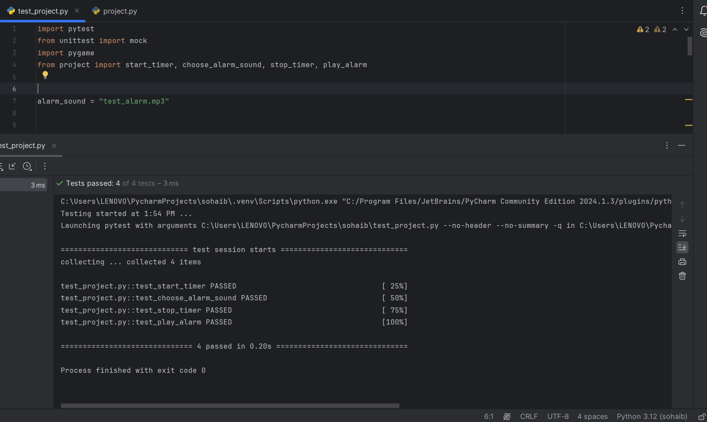
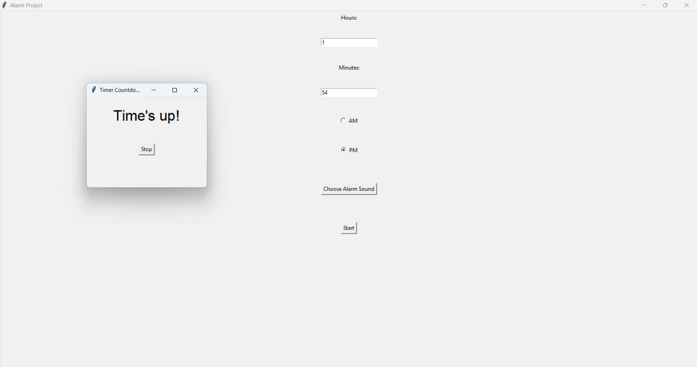

# ⏰ Python Alarm Clock with Custom Sound

This project is a **graphical alarm clock** built with Python. It allows users to:

- Set an alarm using hours, minutes, and AM/PM selection
- Choose any `.mp3` or `.wav` file as the alarm sound
- Watch a live countdown window
- Stop the alarm anytime with a button

✅ **Built by Sohaib Raid Rasheed as part of the CS50 Final Project**

---
## 📸 Demo & Screenshots

  

---



---

## 📁 Project Structure

```bash
.
├── project.py           # Main Gradio app for entering and saving grades
├── test_project.py    # Script to print out all saved student records
├── audio/              # not necessary to be with the same directory you can put it any where
│   └── music.mp3

---
```

## 🧠 Features

- 🎵 Custom alarm sound via file picker
- 🕒 Accurate alarm time with AM/PM support
- ⏳ Countdown timer window
- 🛑 Stop alarm manually
- ✅ Alarm automatically adjusts for next day if set in the past
- 🧪 Pytest-compatible test file to verify basic functionality

---

## 📦 Requirements

- Python 3.8 or later
- Packages:
  - `pygame`
  - `pytest` (for testing)
Install with:
```bash
pip install pygame pytest
```
## 📁 How to use it

1. Download the two files (`project.py` and `test_project.py`) and open them in any Python editor
2. install the requirement as i told you put this command in the terminal ("pip install pygame pytest").
3. Run `project.py` — it will open a window, In the window:
   - Enter the alarm time (hour and minute)
   - Choose AM or PM
   - Select an alarm sound file (.mp3 or .wav)
   - Click Start
4. A new countdown window will appear showing the time left.
5. When the time is up, your selected sound will play.
6. Click Stop to stop the alarm.
7. you can chich if the program is passed the CS50 test by running the (`test_project.py`).
8. Enjoy using it 🎉.
   
---

Don't forgit to give me a ⭐ on this project if you liked it


